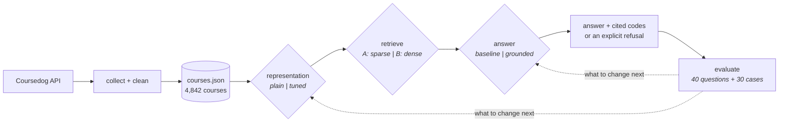

# ISU Course Catalog RAG — two retrieval modules, one controlled experiment

A retrieval-augmented question answering pipeline over the Illinois State
University course catalog, built so that the parts that matter can be swapped and
measured rather than argued about.

**4,842 courses · 40 retrieval questions · 30 behavioural cases · 11 measured configurations**

---

## The question

Given a student's question — *"How many credits is IT 214?"*, *"Which courses
cover machine learning?"* — which courses should the system retrieve, what should
it then say, and how do you know either answer is any good?

## The data

The catalog is a Coursedog single-page app, so a link-following crawler returns a
nav bar and zero courses. Its own front end reads a public JSON API, and that is
what the collector calls. No key and no login; Coursedog serves many schools from
one endpoint and returns 401 unless the request sends `Origin` and `Referer`
naming the catalog site.

| | |
|---|---|
| Snapshot | 2026–2027 Catalog, effective 2026-05-18, collected Sept 2026 |
| Courses | 4,842 active · 62 subjects · 8 colleges · 42 departments |
| Levels | 2,951 undergraduate · 1,881 graduate · 10 continuing ed |
| Indexed text | 1.95 M characters (median 375 per course) |
| Committed corpus | `data/courses.json`, 1.5 MB |

Seven cleaning passes. The one worth naming: **363 records (7.5%) contain a
`U+2008 PUNCTUATION SPACE` inside a prerequisite** — invisible on screen, survives
a naive whitespace clean, and silently breaks every exact-match comparison
downstream. It was found by a behavioural test failing when it should have passed.


## The workflow

Two swap points: which retriever, and which answering policy. Everything else is
held fixed, so anything that moves is attributable.



## Experimental design — A/B at three levels

**Model A** is sparse retrieval (Okapi BM25): match on shared words, weighted by
rarity. **Model B** is dense retrieval: one vector per course, nearest neighbour
by cosine, with a pluggable encoder.

### 1 · Base model A vs base model B

| | nDCG@10 | Hit@1 | ms/query |
|---|---|---|---|
| **A · BM25** | **0.498** | 0.500 | 0.15 |
| **B · dense (LSA 384d)** | 0.400 | 0.400 | 15.41 |
| **B · dense (GloVe 300d)** | 0.294 | 0.250 | 0.29 |

A wins — course questions are mostly lexical, which is what BM25 is for. The two
dense rows are the same architecture with different vector spaces, which
separates *dense retrieval helps* from *a pretrained encoder helps*.

### 2 · Behavioural refinement, A vs B

**Retrieval layer** — close up spaced course codes, weight the title 3×:

| | plain | tuned | Δ |
|---|---|---|---|
| **A · BM25** | 0.498 | **0.739** | **+0.241** |
| **B · dense (LSA)** | 0.400 | 0.592 | +0.192 |

**Answer layer** — schema guard, calibrated abstention, citations:

| | overall pass | fact accuracy | correct refusal | answered anyway |
|---|---|---|---|---|
| A · baseline | 0.467 | **1.000** | 0.111 | 0.889 |
| A · grounded | **0.733** | 0.833 | **0.667** | 0.333 |

### 3 · Test cases, A vs B

| retrieval type | A (tuned) | B (tuned) | | behavioural family | A baseline | A grounded |
|---|---|---|---|---|---|---|
| course code | **1.000** | 0.536 | | answerable | **1.000** | 0.833 |
| exact title | **0.950** | 0.867 | | unsupported field | 0.000 | **1.000** |
| paraphrase | 0.061 | 0.039 | | not in catalog | 0.333 | 0.500 |
| topic | **0.944** | 0.925 | | out of scope | 0.000 | 0.250 |


## Three findings

**1 · How you index beat what you index with.** The representation change moved
BM25 +0.241 nDCG@10 — more than any change of retrieval method produced. On code
questions, 0.167 → **1.000**. A course code is one token in the catalog (`IT214`)
and two in the way a student types it (`IT 214`), so the most common question
anyone asks could not match the course it named.

**2 · Behavioural refinement changes refusal, not facts.** The baseline policy
already quoted credit hours perfectly — and answered **89%** of the questions it
should have refused. Asked who teaches IT 214 it returns the course description;
asked about the weather it returns *Geology of Illinois*. Grounding lifts correct
refusal 0.111 → 0.667 and costs two wrongly-refused questions. For advising that
is the right trade.

**3 · Everything fails on paraphrase.** Nine of ten questions describing a course
without its vocabulary are missed by every arm. That is the ceiling, and it is the
category a real question most resembles. It is also the one a pretrained sentence
encoder is most likely to lift — the arm this environment could not download.


## Repository map

```
data/courses.json          cleaned corpus, committed so results reproduce offline
src/isu_rag/
  corpus.py                shared loader + the Representation config
  base.py                  the Retriever interface both modules implement
  sparse_rag.py            Module A — Okapi BM25
  dense_rag.py             Module B — dense vectors, pluggable encoder
  hybrid.py                reciprocal rank fusion of the two
  behavior.py              answering layer: baseline vs grounded policy
  questions.py             40 retrieval questions, four types
  behavior_tests.py        30 behavioural cases, four families
  experiment.py            metrics harness
scripts/
  collect_catalog.py       collect + clean from the API
  run_retrieval_ab.py      levels 1 and 2a
  run_behavior_ab.py       level 2b
  make_charts.py           the three figures
notebooks/
  01_collect_catalog.ipynb the collector, annotated
  02_rag_experiment.ipynb  both modules + the experiment, runnable in Colab
docs/                      DATA · WORKFLOW · EXPERIMENT · DISCUSSION
results/                   the JSON every number above comes from, plus figures
```

## Run it

```bash
pip install -r requirements.txt

python scripts/run_retrieval_ab.py     # levels 1 + 2a  (~15 s)
python scripts/run_behavior_ab.py      # level 2b       (~10 s)
python scripts/make_charts.py          # the three figures

python scripts/collect_catalog.py      # optional: re-pull the catalog
```

Optional extra arms: `pip install spacy && python -m spacy download en_core_web_md`
adds the GloVe encoder; `pip install sentence-transformers` adds MiniLM.

Use one module on its own:

```python
from isu_rag import load_corpus, SparseRAG, TUNED

courses = load_corpus("data/courses.json")
rag = SparseRAG(rep=TUNED).fit(courses)
for hit in rag.search("Which courses cover machine learning?", k=4):
    print(hit.rank, hit.code, hit.course.title)

# 1 IT348   Introduction to Machine Learning
# 2 IT448   Introduction to Machine Learning
# 3 ELE290  Machine Learning for Engineers
# 4 IT344   Techniques and Tools in Applied Machine Learning
```

Swap `SparseRAG` for `DenseRAG(SpacyVectorEncoder(), rep=TUNED)` — same interface,
so anything built on one works with the other.

Retrieval is ranking, not filtering: a structured question like *"what 300-level
IT courses are there"* needs a filter over `course.level` and `course.subject`
after retrieval, which is what `behavior.py` layers on top.

## Honest limits

Forty questions means one question is worth 2.5 points of Hit@1, so the small
gaps here are noise. The questions were written by the person who built the
modules. And the strongest dense encoder — `all-MiniLM-L6-v2` — was never tested,
because the environment this ran in could not reach the weights; **"dense lost"
is provisional** until that arm runs.

---

*IT 344 · Illinois State University · data from the public
[ISU course catalog](https://catalog.illinoisstate.edu).*
